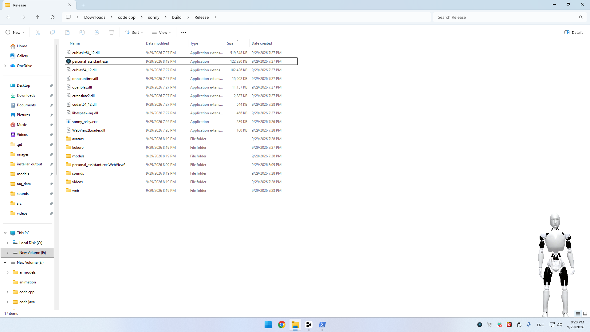
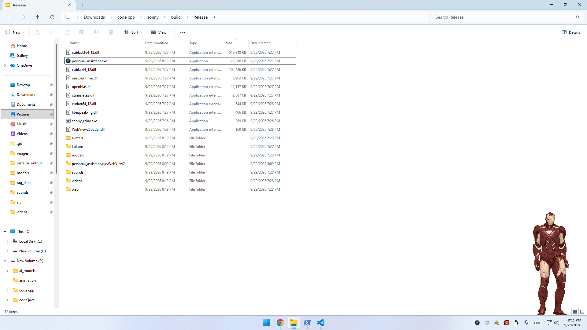

# Sonny — Local AI That Can Actually Use Your Computer

<p align="center">
  
</p>

<p align="center">
  <strong>A native C++ desktop AI assistant with voice, vision, browser automation, memory, and computer control.</strong>
</p>

<p align="center">
  <a href="#-demo">Demo</a> •
  <a href="#-features">Features</a> •
  <a href="#-privacy">Privacy</a> •
  <a href="#-quick-start">Quick Start</a> •
  <a href="#-architecture">Architecture</a> •
  <a href="#-building-from-source">Build</a>
</p>

---

> **Sonny is a local-first AI assistant for Windows that can hear you, see through your camera, browse the web, control your computer, remember information, and speak back — with the core AI stack running directly on your machine.**

<p align="center">
  
</p>

> **Demo GIF coming soon**
<table>
  <tr>
    <td align="center"></td>
    <td align="center"></td>
  </tr>
  <tr>
    <td align="center"><em>Sonny</em></td>
    <td align="center"><em>Iron Man</em></td>
  </tr>
</table>
## Why Sonny?

Most AI assistants can **talk**.

Sonny is designed to **act**.

You can say things like:

```text
"Sonny, search Google for the latest C++ news."

"Open the first result and summarize it."

"Play some music."

"What am I holding?"

"Find that file on my computer."

"Open YouTube and play this video."

"Remember that I prefer..."

```

Sonny turns those requests into actions through a local tool system.

### The idea

```text
       YOU
        │
        │ voice / text
        ▼
┌───────────────────┐
│      SONNY        │
│                   │
│  Local LLM        │
│  Voice            │
│  Vision           │
│  Memory           │
│  Tool Calling     │
└─────────┬─────────┘
          │
    ┌─────┼─────────────┐
    ▼     ▼             ▼
 Browser  PC          Camera
    │     │             │
    ▼     ▼             ▼
  Search Files       Vision
  YouTube System     Images
  Forms   Media
```

---

# ✨ Features

## 🎙️ Natural Voice Interaction

Sonny supports a complete local voice pipeline:

* Wake-word detection
* Voice activity detection
* Local Whisper speech recognition
* Local neural text-to-speech
* Configurable microphone gain
* Optional browser-based speech fallback
* Streaming responses

```text
Microphone
    ↓
Wake Word / VAD
    ↓
Whisper
    ↓
Local LLM
    ↓
Tool Calls
    ↓
Kokoro TTS
    ↓
Speakers
```

---

## 🧠 Local LLM

Sonny uses [`llama.cpp`](https://github.com/ggml-org/llama.cpp) to run GGUF language models locally.

The model can:

* Understand natural-language commands
* Decide when to use tools
* Execute tools
* Read tool results
* Continue reasoning after tool execution
* Generate spoken responses
* Use local retrieval context
* Support LoRA adapters

The LLM receives the registered tool schemas and decides when an action is required.

---

## 👁️ Vision

Sonny can look at the world around you.

With a supported vision model, Sonny can:

* Inspect camera frames
* Look at your screen
* Answer questions about images
* Capture photos
* Record video
* Open captured media

For example:

```text
You:
"What do you see?"

Sonny:
"I can see..."
```

Vision requests are routed through the multimodal GGUF/`mtmd` pipeline when a compatible projector is available.

---

## 🌐 Browser Automation

This is one of Sonny's core features.

Sonny can control a dedicated Chromium session through the Chrome DevTools Protocol.

It can:

* Open websites
* Navigate pages
* Search
* Read pages
* Find elements
* Click
* Fill forms
* Scroll
* Press keys
* Switch tabs
* Take screenshots
* Generate PDFs
* Play YouTube videos
* Autofill supported fields

Example:

```text
"Open Google."

"Search for the latest NVIDIA GPU."

"Open the first result."

"Read this page and summarize it."

"Search YouTube for C++ tutorials."

"Play the first result."
```

The browser automation stack is implemented in C++ around CDP rather than depending on a Node.js or Python automation runtime.

---

## 🛠️ Tool Calling

Sonny currently exposes **16 registered tools** to the LLM.

| Tool                   | Capability                   |
| ---------------------- | ---------------------------- |
| Browser                | Control Chromium             |
| Google Search          | Search Google                |
| Web Search             | Search the web               |
| YouTube Search         | Search YouTube               |
| YouTube Video          | Open/play videos             |
| System Command         | Execute system commands      |
| Calculator             | Mathematical expressions     |
| Time                   | Current date/time            |
| Clipboard              | Read/write clipboard         |
| File Operations        | Read/write/list/delete files |
| File Explorer          | Navigate files               |
| Music Player           | Control local media          |
| Add Media Directory    | Register media folders       |
| Remove Media Directory | Remove media folders         |
| List Media Library     | Search media libraries       |
| Camera                 | Photos and recordings        |

The architecture is designed so additional tools can be registered without changing the core assistant loop.

---

# 💾 Memory & RAG

Sonny can remember information locally.

The native C++ retrieval engine combines:

* BM25 lexical search
* Dense vector similarity
* Local embeddings
* Conversation memory
* User-taught facts
* Document indexing

Your data is stored locally under:

```text
%APPDATA%\Sonny\rag_data\
```

Example:

```text
You:
"Remember that my favorite editor is VS Code."

Later:

"What editor do I use?"

Sonny:
"You prefer VS Code."
```

---

# 🕸️ Optional Sonny Vectors Network

Sonny also contains an **opt-in peer network** for sharing aggregated knowledge between Sonny instances.

The system is designed around content-free aggregates rather than conversations.

The implementation includes:

* LAN peer discovery
* WAN relay support
* HMAC signing
* Noise
* K-anonymity controls
* Vector clipping
* Aggregated tool metrics
* Optional LoRA adapter synchronization

See [`docs/VECTORS.md`](docs/VECTORS.md) for the technical design.

> **Important:** Review and configure the vectors settings according to your privacy requirements before enabling network synchronization.

---

# 🤖 3D Desktop Avatar

Sonny isn't just a terminal window.

The application includes a DirectX 11 desktop overlay capable of rendering a GLB avatar with:

* Skeletal animation
* Skinning
* Transparency
* Desktop positioning
* Configurable visibility

The repository currently includes Sonny and Iron Man avatar assets.

---

# 🔒 Privacy

Sonny is designed around a local-first architecture.

The main AI pipeline runs directly on your computer:

```text
Microphone
    ↓
Local Whisper
    ↓
Local LLM
    ↓
Local Tools
    ↓
Local Memory
    ↓
Local TTS
```

The running assistant does not require a Python server or a separate inference server.

Local components include:

* Speech recognition
* LLM inference
* Text-to-speech
* Embeddings
* Retrieval
* Conversation memory
* Browser automation
* Vision
* Avatar rendering

The optional vectors system is separate and can be disabled.

### Browser credentials

Sonny uses a dedicated Chromium profile rather than your normal browser profile.

Credentials and autofill data are stored locally, with browser credentials protected using Windows DPAPI.

---

# ⚡ Native C++

Sonny is intentionally built as a native C++ application.

The goal is to keep the major runtime components inside one application rather than building the assistant around a collection of Python services.

The project integrates:

* `llama.cpp`
* CTranslate2
* Whisper
* Kokoro
* ONNX Runtime
* openWakeWord
* Silero VAD
* DirectX 11
* WASAPI
* DirectShow
* WebView2
* Chrome DevTools Protocol

---

# 🏗️ Architecture

At a high level:

```text
┌─────────────────────────────────────────────────────────┐
│                    SONNY APPLICATION                    │
│                                                         │
│  ┌─────────────── AssistantOrchestrator ─────────────┐ │
│  │                                                   │ │
│  │   Voice → LLM → Tools → Memory → Response       │ │
│  │                                                   │ │
│  └───────┬──────────┬───────────┬───────────┬───────┘ │
│          │          │           │           │         │
│          ▼          ▼           ▼           ▼         │
│       Audio       Llama       RAG        Tools        │
│          │          │           │           │         │
│          ▼          ▼           ▼           ▼         │
│      Whisper     llama.cpp   Embeddings   Browser     │
│      VAD         GGUF        BM25         Files       │
│      Wake Word   Vision      Memory       System      │
│      Kokoro                  Vectors      Camera      │
│                                                         │
│                    DirectX 11 / UI                      │
└─────────────────────────────────────────────────────────┘
```

### Voice pipeline

```text
Microphone
    │
    ▼
WASAPI
    │
    ▼
Wake Word / Silero VAD
    │
    ▼
Whisper / CTranslate2
    │
    ▼
AssistantOrchestrator
    │
    ├──────────────► RAG Memory
    │
    ▼
llama.cpp
    │
    ├──────────────► Tool
    │                    │
    │                    ▼
    │               Tool Result
    │                    │
    └────────────────────┘
    │
    ▼
Kokoro TTS
    │
    ▼
Speakers
```

---

# 🧩 Project Structure

```text
src/
├── core/           # Assistant orchestration, settings, tray, camera
├── ai/             # LLM, TTS, RAG, embeddings
├── audio/          # Audio capture, Whisper, wake word, VAD
├── browser/        # Chromium/CDP automation
├── net/            # Vectors network
├── tools/          # Assistant tools
├── ui/             # Avatar and visual components
└── utils/          # Shared utilities

resources/
├── avatars/
├── images/
├── videos/
├── sounds/
└── models/

docs/
├── BUILD_CONFIG.md
└── VECTORS.md

installer/
└── Product.wxs
```

---

# 🚀 Quick Start

## Requirements

### Minimum

* Windows 10 64-bit
* Intel Core i5 8th Gen or equivalent
* 8 GB RAM
* NVIDIA GTX 1060 6 GB or another Vulkan-capable GPU
* ~10 GB free disk space + your GGUF model
* Windows-compatible microphone and speakers
* Chrome or Edge

### Recommended

* Windows 11 64-bit
* Intel Core i7 11th Gen or equivalent
* 16 GB RAM
* NVIDIA RTX 3060 12 GB or better
* SSD

---

# 📦 Build From Source

### 1. Clone

```bash
git clone https://github.com/ahmed19maher9/Sonny-Personal-Assistant.git
cd Sonny-Personal-Assistant
```

### 2. Configure and build

From a Visual Studio developer environment:

```bat
cmake.bat
```

The project uses the Visual Studio 2022 x64 generator.

Dependencies that are not already present are provisioned during configuration.

### 3. Run

```bat
cd build\Release
personal_assistant.exe
```

On first launch, Sonny will ask you for the GGUF model path.

---

# 🧠 Model Setup

Sonny uses GGUF models through `llama.cpp`.

Configure your model in the first-run wizard or:

```text
%APPDATA%\Sonny\config.ini
```

Example:

```ini
[Settings]
llama_model_path=C:\ai_models\your-model.gguf
kokoro_voice=af_heart
language=en
tts_speed=1.15
avatar_type=sonny
show_avatar=true
wake_word_enabled=false
camera_feed_enabled=true
```

For vision, place a compatible `mmproj-*.gguf` projector alongside the vision-capable GGUF model.

---

# ⚙️ GPU Support

Sonny automatically selects the available inference backend.

| Hardware | Backend |
| -------- | ------- |
| NVIDIA   | CUDA    |
| AMD      | Vulkan  |
| Intel    | Vulkan  |
| CPU only | CPU     |

CUDA and Vulkan support are configured automatically by default.

You can override this behavior with:

```text
-DSONNY_LLAMA_CUDA=ON|OFF|AUTO
-DSONNY_LLAMA_VULKAN=ON|OFF|AUTO
-DSONNY_LLAMA_CUDA_ARCH=native
```

---

# 🛠️ Useful Build Commands

### Clean build

```bat
cmake.bat clean
cmake.bat
```

### Incremental build

```bat
build.bat
```

### Manual CMake build

```bash
mkdir build
cd build

cmake .. -G "Visual Studio 17 2022" -A x64 -DCMAKE_BUILD_TYPE=Release

cmake --build . --config Release -j
```

### MSI installer

```bat
build_installer.bat
```

The installer requires WiX Toolset.

---

# 🧪 Technical Details

For deeper implementation details, see:

* [`docs/BUILD_CONFIG.md`](docs/BUILD_CONFIG.md)
* [`docs/VECTORS.md`](docs/VECTORS.md)

Important implementation areas include:

```text
src/core/AssistantOrchestrator
src/ai/LlamaWrapper
src/ai/KokoroWrapper
src/ai/RagEngine
src/ai/EmbeddingEngine
src/audio/STTEngineWrapper
src/audio/WakeWordEngine
src/audio/VADEngine
src/browser/
src/net/
src/tools/
src/ui/
```

---

# 🔐 Where Sonny Stores Data

| Data                 | Location                               |
| -------------------- | -------------------------------------- |
| Configuration        | `%APPDATA%\Sonny\config.ini`           |
| RAG / memory         | `%APPDATA%\Sonny\rag_data\`            |
| Browser profile      | `%APPDATA%\Sonny\browser-profile`      |
| Browser credentials  | `%APPDATA%\Sonny\browser_profile.json` |
| Screenshots          | `%APPDATA%\Sonny\screenshots`          |
| Downloads/PDFs       | `%USERPROFILE%\Downloads\Sonny`        |
| Vector node identity | `%APPDATA%\Sonny\vectors\`             |

---

# 🐛 Troubleshooting

### Model won't load

Make sure the GGUF architecture is supported by the pinned `llama.cpp` version.

### No speech recognition

Check:

* Windows microphone permissions
* Input device
* Microphone level
* `mic_gain`
* Wake-word configuration

### Wake word doesn't trigger

Wake-word detection is disabled by default.

Enable:

```ini
wake_word_enabled=true
```

and verify the OpenWakeWord model files exist.

### Browser automation doesn't start

Make sure Chrome or Edge is installed and that Sonny's dedicated browser profile isn't locked by another Sonny browser instance.

### Avatar doesn't appear

Check:

```ini
show_avatar=true
```

and verify that the GLB avatar asset is available.

---

# 🗺️ Roadmap

The project is actively evolving.

Potential areas of development:

* [ ] Easier one-click installation
* [ ] Prebuilt Windows releases
* [ ] Better onboarding
* [ ] More computer-control tools
* [ ] More vision capabilities
* [ ] More LLM/model compatibility
* [ ] Improved wake-word customization
* [ ] Better browser automation coverage
* [ ] More desktop integrations
* [ ] Community-contributed tools
* [ ] Improved documentation
* [ ] Performance benchmarking

Have an idea?

**Open an issue and describe what you want Sonny to be able to do.**

---

# 🤝 Contributing

Contributions are welcome.

Some useful areas:

* New tools
* Browser workflows
* Vision features
* Performance improvements
* UI/UX
* Documentation
* Model compatibility
* Windows integration
* Bug fixes

A great first contribution is a new tool that gives Sonny a useful capability.

---

# ⭐ Support the Project

If Sonny is interesting to you:

1. ⭐ **Star the repository**
2. 🐛 Report bugs
3. 💡 Suggest features
4. 🔧 Submit pull requests
5. 📢 Share the project

Every star and contribution helps the project reach more developers interested in local AI and native C++.

---

# 📜 Dependencies

Sonny integrates several open-source projects, including:

* llama.cpp
* CTranslate2
* Kokoro
* ONNX Runtime
* OpenBLAS
* eSpeak NG
* tinygltf
* WebView2
* vis-network
* WiX Toolset

Please see the project's dependency/license documentation before redistributing builds.

---

# 📄 License

See the repository license files for the applicable license terms for Sonny and its bundled dependencies.

---

<p align="center">

### 🧠 Local AI

### 🎙️ Voice

### 👁️ Vision

### 🌐 Browser Automation

### 💾 Memory

### 🛠️ Computer Control

### ⚡ Native C++

**Sonny is an experiment in what a local AI assistant can actually do when it is given access to your computer.**

**[⭐ Star the repository](https://github.com/ahmed19maher9/Sonny-Personal-Assistant)**

</p>
